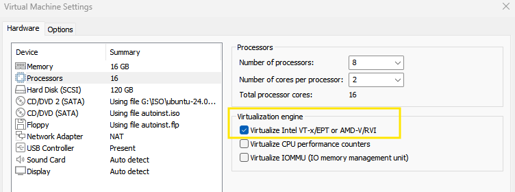

# NICS | CyberLab — Guía de uso del repositorio

### Entorno de Laboratorio Automatizado (Versión Demo)

Este repositorio contiene la versión demo y experimental de **NICS | CyberLab**, un entorno de laboratorio automatizado diseñado para pruebas, formación y experimentación en ciberseguridad. El proyecto permite desplegar rápidamente la infraestructura base del laboratorio mediante un único script de instalación y ejecutar módulos adicionales de prueba, como la PoC de **OpenStack + Snort 3**.

**NICS | CyberLab** es un laboratorio automatizado orientado a **capacitación en ciberseguridad**, diseñado para entrenar un flujo realista de un entorno SOC:

**detección → investigación → mejora → reporte**

El repositorio le permite desplegar infraestructura (OpenStack), levantar escenarios por niveles (ej. Level-01: Mini SOC con Snort + Wazuh + Caldera) y dejar trazabilidad completa en logs para documentar evidencias.

> ℹ️ **Nota:** todo lo incluido está pensado para un **entorno de laboratorio autorizado y controlado**. No reutilice técnicas o automatizaciones fuera del contexto permitido.

---

## Índice

* [1. Qué ofrece este repositorio](#1-qué-ofrece-este-repositorio)
* [2. Requisitos mínimos y recomendados](#2-requisitos-mínimos-y-recomendados)
* [3. Estructura del proyecto](#3-estructura-del-proyecto)
* [4. Flujo recomendado (Quickstart)](#4-flujo-recomendado-quickstart)
* [5. Logs y resúmenes (evidencias)](#5-logs-y-resúmenes-evidencias)
* [6. Scripts principales y para qué sirven](#6-scripts-principales-y-para-qué-sirven)
* [7. Artefactos generados (deploy/ y admin-openrc.sh)](#7-artefactos-generados-deploy-y-admin-openrcsh)
* [8. Limpieza del entorno (automática y manual)](#8-limpieza-del-entorno-automática-y-manual)
* [9. Operación manual y recuperación](#9-operación-manual-y-recuperación)
* [10. Niveles y ejercicios](#10-niveles-y-ejercicios)
* [11. Buenas prácticas](#11-buenas-prácticas)

---

## 1. Qué ofrece este repositorio

Este repositorio le permite:

1. Preparar el host y desplegar la base del laboratorio con un único script.
2. Desplegar OpenStack + recursos (imágenes, redes, flavors, SG, keypair) de forma automatizada.
3. Levantar escenarios por niveles (por ejemplo `lab/level-01.sh`).
4. Obtener **logs** y un **resumen final** con datos operativos (IPs/URLs/credenciales).
5. Limpiar el entorno de forma controlada (desde “solo el nivel” hasta “borrar OpenStack del host”).

---

## 2. Requisitos mínimos y recomendados

* **Mínimo funcional:** configuración que permite que el laboratorio funcione con fluidez en una máquina local.
* **Recomendado:** configuración pensada para trabajar con **más estabilidad**, repetir despliegues con frecuencia y disponer de **margen de crecimiento** para niveles y escenarios con más componentes simultáneos.

| Recurso            |                            Mínimo funcional |                                 Recomendado |
| ------------------ | ------------------------------------------: | ------------------------------------------: |
| **CPU**            |                                      8 vCPU |                                     16 vCPU |
| **RAM**            |                                       16 GB |                                       32 GB |
| **Disco**          |                                  120 GB SSD |                         240–300 GB SSD/NVMe |
| **Virtualización** | Soportada por CPU y habilitada (AMD-V/VT-x) | Soportada por CPU y habilitada (AMD-V/VT-x) |
| **SO**             |      Linux 64 bits (Ubuntu 24.04) |      Linux 64 bits (Ubuntu 24.04) |
| **Red**            |                               NAT funcional |                          Bridge recomendado |

> 💡 **Recomendación:** si su objetivo es desplegar niveles con varias máquinas o repetir prácticas con frecuencia, use el perfil **Recomendado** y disco NVMe.

---

### Activación de virtualización anidada (nested VT-x/AMD-V) en Windows 11 con VMware Workstation/Player

Este ajuste se usa cuando necesitas que una VM pueda crear y arrancar otras máquinas dentro. Si esa capacidad no está disponible, lo normal es que las instancias no terminen de arrancar y aparezcan errores del hipervisor. En Windows 11, algunas funciones de virtualización que vienen activadas pueden interferir con VMware y evitar que se pueda activar esta opción; por eso se desactivan antes.

#### **Requisitos previos:**

  1) La máquina virtual debe de estar apagada obligatoriamente.

  2) Virtualización activada en BIOS/UEFI

En Windows 11 puedes comprobarlo así:

* **Administrador de tareas → Rendimiento → CPU → “Virtualización: Habilitada”**

Si aparece “Deshabilitada”, actívalo en BIOS/UEFI (Intel VT-x / AMD-V / SVM).

#### **El bloqueo típico en Windows 11: Hyper-V / VBS / “features” de virtualización**

En algunas instalaciones, Windows deja activadas funciones que **hacen que VMware no pueda usar VT-x “en exclusivo”**, y eso puede impedir que puedas **virtualizar dentro de una VM**.

#### **Desactivar características de Windows (Panel de control):**

1. Abre **Panel de control**
2. Ve a **Programas → Programas y características**
3. Busca: **Activar o desactivar las características de Windows**
4. Desmarca (si están marcadas) estas opciones:
    * **Hyper-V**
    * **Plataforma de hipervisor de Windows (Windows Hypervisor Platform)**
    * **Plataforma de máquina virtual (Virtual Machine Platform)**
    * **Windows Sandbox** (si aparece)
    * **Microsoft Defender Application Guard** (si aparece)
    * **Containers** (si aparece y no lo necesitas)
    * *(Opcional pero común)* **Subsystem for Linux (WSL)** si estás usando WSL2 (porque suele ir ligado a Virtual Machine Platform)

5. Acepta y **reinicia**.

> ℹ️ **Nota:** si desactivas *Virtual Machine Platform / Hypervisor Platform*, puede dejar de funcionar **WSL2** y otras funciones que dependan de Hyper-V. Es el “precio” habitual para que VMware tenga control total de VT-x y permita nested.

#### **Desactivar “Integridad de memoria” (VBS / Core Isolation):**

Esto también puede interferir en algunos equipos:

1. **Seguridad de Windows**
2. **Seguridad del dispositivo**
3. **Aislamiento del núcleo → Detalles**
4. Desactiva **"Integridad de memoria"**
5. **Reinicia**

> ℹ️ **Nota:** Si no lo ves, puede estar gestionado por política o el fabricante.

#### **Activar la opción en VMware:**

1. Abre VMware
2. Selecciona la VM → **Settings** → **Processors**
3. Marca:  
     
   * [✓] **Virtualize Intel VT-x/EPT or AMD-V/RVI**
4. Acepta y arranca la VM.

#### **Si se reitera el fallo (checklist rápido):**

* ¿La VM está **apagada**?
* ¿Has reiniciado tras desmarcar features?
* ¿En **Administrador de tareas** se muestra “Virtualización: Habilitada”?
* Ejecuta esto para ver si Windows aún detecta hipervisor activo:

  En CMD:
  ```bat
  systeminfo | findstr /i "Hyper-V"
  ```

  Si ves algo así: “**Se detectó un hipervisor**”, entonces Hyper-V/VBS sigue activo (revise lo anterior).

---

## 3. Estructura del proyecto

Tras un despliegue completo, el repositorio queda típicamente así:

```
.
├── admin-openrc.sh
├── cyberlab.sh
├── cyberlab-uninstall.sh
├── deploy/
│   ├── openstack-install.sh
│   ├── openstack-resources.sh
│   ├── setup-veth.sh
│   ├── uplinkbridge.sh
│   ├── openstack_venv/
│   ├── img/
│   ├── keys/
│   └── cloud-init/
├── gui/              # Dashboard (demo de referencia)
├── inst/             # Operaciones por componente
├── lab/
│   ├── level-01.sh
│   └── README.md
├── log/
│   ├── cyberlab.log
│   ├── dashboard.log
│   └── level.log
├── preflight-check.sh
├── services_restart.sh
├── set-env.sh
└── undeploy/
    ├── level-01-uninstall.sh
    ├── openstack-resources-uninstall.sh
    ├── openstack-uninstall.sh
    ├── uplinkbridge-uninstall.sh
    ├── admin-openrc_uninstall.sh
    └── clean-inst.sh
```

> ℹ️ **Nota:** la carpeta `log/` se crea tras ejecutar scripts. No aparece en un clonado “en limpio”.

---

## 4. Flujo recomendado (Quickstart)

### 4.1) Clonado y comprobación de permisos

> ⚠️ **Advertencia:** *Despliegue evaluado en **Ubuntu 24.04**.*

Clone el repositorio:

```bash
git clone https://github.com/crismillan06/nics-cyberlab.git
cd nics-cyberlab
```

Compruebe permisos de ejecución. Si ve `x` (ej. `-rwxr-xr-x`), puede omitir cualquier `chmod +x`:

```bash
ls -lh *.sh
ls -lh deploy/*.sh inst/*.sh lab/*.sh gui/*.sh undeploy/*.sh
```

Si faltan permisos, aplíquelos una vez:

```bash
chmod +x *.sh
chmod +x deploy/*.sh inst/*.sh lab/*.sh gui/*.sh undeploy/*.sh
```

> 💡 **Recomendación:** aunque un script no sea ejecutable, siempre puede lanzarlo con `bash script.sh`. Aun así, mantener permisos correctos evita errores de “Permission denied”.

---

### 4.2) Despliegue base

```bash
bash cyberlab.sh
```

Revise el resumen final:

```bash
tail -n 120 log/cyberlab.log
```

> ℹ️ **Nota:** si relanza el despliegue, `cyberlab.sh` puede generar backups tipo `log/cyberlab.log-YYYYMMDD-HHMM.bak`.

---

### 4.3) Dashboard (demo)

Si ya ejecutó `cyberlab.sh`, **no es necesario** lanzar este paso: el dashboard demo se inicia automáticamente en segundo plano.

Si necesita relanzarlo:

```bash
bash gui/start_dashboard.sh
tail -f log/dashboard.log
```

> ⚠️ **Advertencia:** `gui/` es una demo de referencia. Útil para pruebas rápidas, pero no forma parte del núcleo operativo del laboratorio.

---

### 4.4) Level-01 (Mini SOC)

```bash
bash lab/level-01.sh
tail -n 200 log/level.log
```

> 💡 **Recomendación:** use `log/level.log` como “salida operativa”: ahí suele tener IPs, URLs y credenciales del escenario.

---

## 5. Logs y resúmenes (evidencias)

La carpeta `log/` se genera tras ejecutar scripts y deja trazabilidad para documentación (tiempos, endpoints y credenciales).

| Fase           | Script                   | Log                 | Qué encontrará                             |
| -------------- | ------------------------ | ------------------- | ------------------------------------------ |
| Deploy base    | `cyberlab.sh`            | `log/cyberlab.log`  | Acciones, validaciones y **resumen final** |
| Dashboard demo | `gui/start_dashboard.sh` | `log/dashboard.log` | Estado/puertos del servicio demo y errores |
| Nivel          | `lab/level-01.sh`        | `log/level.log`     | Datos operativos del nivel + outputs       |

Búsqueda rápida de fallos típicos:

```bash
grep -iE "error|fail|fatal|traceback|exception|warn" log/*.log | tail -n 120
```

> ℹ️ **Nota:** un laboratorio “sano” suele reflejarlo en el resumen final (IPs y endpoints coherentes). Si el resumen está incompleto, empiece por el primer error relevante del log.

---

## 6. Scripts principales y para qué sirven

* **`cyberlab.sh`**: orquesta el despliegue completo y deja resumen en `log/cyberlab.log`.
* **`preflight-check.sh`**: valida host (recursos, red, virtualización) para evitar fallos repetidos.
* **`set-env.sh`**: prepara el modo CLI en un paso:

  1. activa `deploy/openstack_venv` (para disponer de `openstack`),
  2. carga `admin-openrc.sh` (variables `OS_*`).
* **`services_restart.sh`**: recuperación cuando OpenStack queda en estado inconsistente (servicios/containers caídos).
* **`inst/`**: operaciones por componente (Snort/Wazuh/Caldera y combinaciones).

  > 💡 **Recomendación:** use `lab/level-01.sh` salvo que esté depurando un componente concreto.
* **`lab/level-01.sh`**: despliega el “Mini SOC” y consolida salida en `log/level.log`.

---

## 7. Artefactos generados (deploy/ y admin-openrc.sh)

### 7.1) `admin-openrc.sh`

Archivo de variables `OS_*` para autenticación OpenStack.

> ℹ️ **Nota:** el laboratorio se apoya en un **entorno virtual (venv)** para mantener el host limpio y evitar dependencias globales.

Uso manual por pasos:

```bash
source deploy/openstack_venv/bin/activate
source admin-openrc.sh
openstack token issue
deactivate
```

> 💡 **Recomendación:** use `source set-env.sh` para activar venv y cargar credenciales en un único paso.

### 7.2) Carpeta `deploy/`

* `openstack_venv/` → herramientas OpenStack CLI y dependencias.
* `img/` → imágenes base descargadas/convertidas.
* `keys/` → claves (ej. `my_key.pem`) para acceso a instancias.
* `cloud-init/` → plantillas/credenciales iniciales.
* `openstack-install.sh` / `openstack-resources.sh` → instalación y creación de recursos.
* `uplinkbridge.sh` / `setup-veth.sh` → red auxiliar del host (si aplica).

---

## 8. Limpieza del entorno (automática y manual)

### 8.1) Limpieza automática

```bash
bash cyberlab-uninstall.sh
```

> 💡 **Recomendación:** use esta opción si su objetivo es volver a un estado limpio sin preocuparse del orden.

### 8.2) Limpieza manual (orden recomendado)

1. Nivel:

```bash
bash undeploy/level-01-uninstall.sh
```

2. Recursos OpenStack del stack:

```bash
bash undeploy/openstack-resources-uninstall.sh
```

3. OpenStack/Kolla/Docker del host:

```bash
sudo bash undeploy/openstack-uninstall.sh --safe
```

4. Red auxiliar/OVS/veth (host “como antes”):

```bash
sudo bash undeploy/uplinkbridge-uninstall.sh
```

### 8.3) Limpieza agresiva (casos especiales)

```bash
bash undeploy/clean-inst.sh --force
```

> ⚠️ **Advertencia:** `--all-projects` borra instancias en todos los proyectos (solo admin). Úselo únicamente en laboratorio y sabiendo exactamente qué hace.

---

## 9. Operación manual y recuperación

Este apartado le permite **verificar el estado**, **consultar recursos clave** y **reaccionar** si algo no responde, sin depender del despliegue automático.

### 9.1) Preparación (1 comando)

```bash
source set-env.sh
```

> ℹ️ **Nota:** si falla, lo más habitual es que falte `deploy/openstack_venv/` o `admin-openrc.sh`.

### 9.2) Comprobación rápida (¿hay acceso?)

```bash
openstack token issue
```

* Si devuelve token: **[✓]** credenciales correctas.
* Si no conecta: revise servicios (siguiente punto).

### 9.3) Lectura rápida del estado

```bash
openstack server list
openstack network list
openstack floating ip list
```

> 💡 **Recomendación:** si aquí todo es coherente (instancias activas y redes correctas), el nivel suele estar operativo.

### 9.4) Recuperación (2 pasos)

```bash
bash services_restart.sh
source set-env.sh
openstack token issue
```

> ⚠️ **Advertencia:** si tras reiniciar servicios sigue fallando, revise los logs (especialmente el primer error real, no el efecto cascada).

---

## 10. Niveles y ejercicios

Los ejercicios y el enfoque formativo están documentados en:

📌 **`lab/README.md`**

Actualmente existe **Level-01** enfocado a prácticas SOC; NICS | CyberLab está diseñado para crecer con Level-02/03 y más escenarios.

---

## 11. Buenas prácticas

* Ejecute scripts **desde la raíz** del repositorio.
* Conserve `log/` como evidencia de práctica.
* No reutilice automatizaciones fuera de laboratorio.
* Use `source set-env.sh` para evitar problemas de rutas/venv y credenciales.
* Realice **snapshot** de la VM antes de cambios grandes.

---

###### © NICS LAB — NICS | CyberLab

*Proyecto para entornos de laboratorio y formación en ciberseguridad.*
